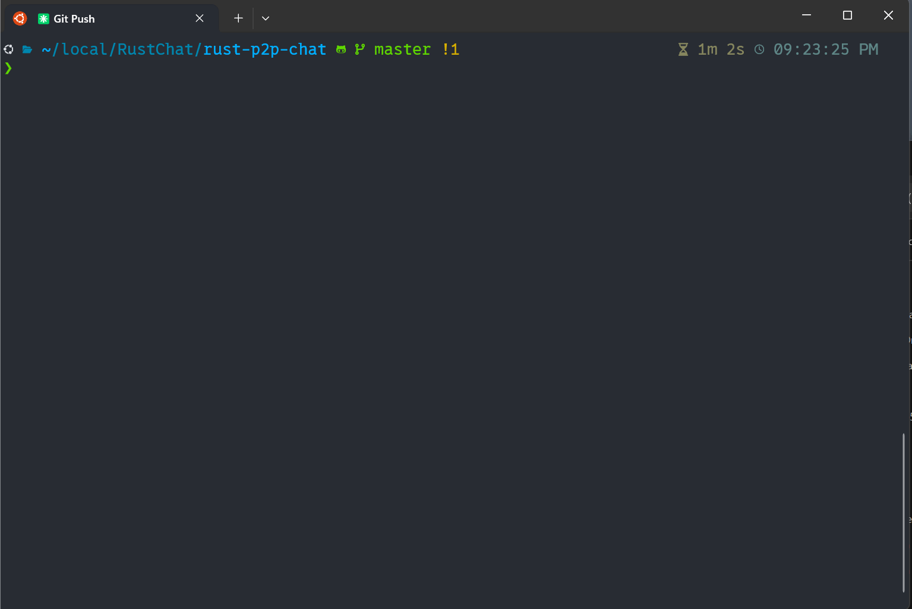

# Rust P2P Chat

A decentralized peer-to-peer chat application built with Rust and Tokio. Provides real-time communication without intermediary servers through direct connections between peers.

See [Features](Features.md) and [ChangeLog](ChangeLog.md)

## Table of Contents

- [Key Highlights](#key-highlights)
- [What Makes This Special](#what-makes-this-special)
- [Demo](#demo)
- [Quick Start](#quick-start)
- [Features](#features)
- [Usage](#usage)
- [Commands](#commands)
- [Configuration](#configuration)
- [Building from Source](#building-from-source)
- [Testing](#testing)
- [Shell Scripts](#shell-scripts)
- [Connecting Over the Internet](#connecting-over-the-internet)
- [Security](#security)
- [Contributing](#contributing)
- [License](#license)

## Key Highlights

- **Military-Grade Encryption**: 1024-bit RSA + AES-256-GCM end-to-end encryption
- **Zero Configuration**: Works instantly with just IP:port - no setup required
- **True P2P**: Direct peer connections, no central servers or intermediaries
- **File Transfer**: Send files up to 100MB with progress tracking and auto-open
- **Rich Terminal UI**: Colorful interface with encryption status indicators
- **GUI Support**: Optional graphical interface for enhanced user experience
- **Cross-Platform**: Linux, macOS, Windows support with async Rust performance
- **Media Auto-Open**: Automatically open received images, videos, and documents
- **Smart Downloads**: Files saved to system Downloads folder with verification
- **Comprehensive Testing**: 180+ tests across 10 categories with extensive coverage

## What Makes This Special?

Unlike traditional chat applications that rely on central servers, **Rust P2P Chat** establishes direct TCP connections between peers. There's no "server" and "client" in the traditional sense - both peers are equal participants in the conversation. The first peer simply waits for a connection, while the second initiates it. Once connected, both peers have identical capabilities.

## Demo

Run `shell/test_mux.sh`:



## Quick Start

### Installation

```bash
# Clone the repository
git clone https://github.com/your-username/RustChat.git
cd rust-p2p-chat

# Build and run
cargo run --release
```

### Start Chatting in 30 Seconds

#### Option 1: Using Cargo (Rust installed)

**Terminal 1 (First peer):**
```bash
cargo run --release -- --port 8080
```

**Terminal 2 (Second peer):**
```bash
cargo run --release -- --connect localhost:8080
```

#### Option 2: Using Docker (No Rust required)

```bash
# Quick demo with docker-compose
docker-compose up

# Or run manually in two terminals:
# Terminal 1: docker run -it --rm -p 8080:8080 ghcr.io/your-username/rust-p2p-chat --port 8080  
# Terminal 2: docker run -it --rm ghcr.io/your-username/rust-p2p-chat --connect host.docker.internal:8080
```

You are now chatting peer-to-peer with end-to-end encryption.

## Features

### Core Capabilities
- **True Peer-to-Peer Architecture**: No central server required - direct connections between peers
- **Symmetric Communication**: Once connected, both peers are equal with no client/server hierarchy
- **Real-time Bidirectional Messaging**: Instant message delivery with concurrent send/receive
- **Zero Configuration**: Start chatting with just a port number or peer address
- **Cross-platform Support**: Works seamlessly on Linux, macOS, and Windows
- **End-to-End Encryption**: All messages encrypted using military-grade algorithms
- **Custom Error Types**: Comprehensive error handling with user-friendly messages
- **Message Protocol**: Support for different message types (text, files, commands, status)
- **Message Buffering**: Handles messages up to 8KB with configurable buffer size
- **Heartbeat Mechanism**: Keep-alive functionality to detect connection status

### Technical Features
- **Async/Await Excellence**: Built on Tokio for high-performance async I/O
- **Colorful Terminal UI**: ANSI color support for better user experience
- **GUI Interface**: Optional graphical user interface with `--gui` flag
- **Graceful Error Handling**: Robust connection management and clean disconnection
- **Smart Connection Logic**: Simultaneous connect/listen with automatic fallback
- **Low Latency**: Direct TCP connections ensure minimal message delay
- **Command-line Interface**: Full CLI support with clap, including debug mode
- **Configuration File Support**: TOML-based configuration with customizable settings
- **File Transfer Capability**: Send files up to 100MB with progress tracking
- **Command System**: Built-in commands (/help, /quit, /send, /info, /nick, /autoopen)

### Security Features
- **1024-bit RSA Key Exchange**: Secure public key cryptography for initial handshake
- **AES-256-GCM Encryption**: Military-grade symmetric encryption for messages
- **Automatic Key Generation**: New encryption keys for every session
- **Message Authentication**: Built-in integrity verification with GCM
- **Visual Encryption Indicators**: Icon shows when messages are encrypted
- **TLS Support**: Prepared for TLS encryption (can be enabled)

### Building from Source

See the [Building from Source](#building-from-source) section for detailed instructions.

## Usage

### Running the Application

#### Interactive Mode
```bash
cargo run
```

#### Command-line Mode
```bash
# Start as listener on specific port
cargo run -- --port 8080

# Connect to a peer directly 
cargo run -- --connect 192.168.1.100:8080

# With nickname
cargo run -- --port 8080 --nickname Alice

# Enable debug logging
cargo run -- --port 8080 --debug

# Launch with GUI interface
cargo run -- --gui

# Launch GUI and connect to peer
cargo run -- --gui --connect 192.168.1.100:8080

# Generate default config file
cargo run -- config
```

#### Quick Build and Run Scripts
For convenience, shell scripts are provided in the root directory:

```bash
# Build the project
./b

# Build and run (passes all arguments to the application)
./r
./r --port 8080
./r --gui --connect localhost:8080
```

### Starting a Chat Session

Since this is a **true P2P application**, there's no permanent "server" or "client" - just two equal peers.

1. **First Peer (Listener):**
- Run the application
- Press Enter when prompted for peer address
- Enter a port number (default 8080)
- The peer will bind to `0.0.0.0:port` and wait for incoming connections

2. **Second Peer (Connector):**
- Run the application
- Enter the first peer's address in format `ip:port` (e.g., `127.0.0.1:8080`)
- Connection will be established automatically

**Important**: After connection is established, both peers are completely equal - they can both send and receive messages simultaneously.

### Example Session

**Terminal 1 (First Peer):**
```
$ cargo run
P2P Chat Application
Usage:
1. Start as server: just press Enter when prompted for address
2. Connect to peer: enter address as ip:port (e.g., 127.0.0.1:8080)

Enter peer address (or press Enter to start as server): 
Enter port to listen on (default 8080): 8080
Listening on: 0.0.0.0:8080
Waiting for peer to connect..
Peer connected from: 127.0.0.1:54321
Exchanging encryption keys..
End-to-end encryption enabled.
Type messages and press Enter to send (Ctrl+C to exit)
You: Hello from first peer.
Peer: Hi from second peer.
```

**Terminal 2 (Second Peer):**
```
$ cargo run
P2P Chat Application
Usage:
1. Start as server: just press Enter when prompted for address
2. Connect to peer: enter address as ip:port (e.g., 127.0.0.1:8080)

Enter peer address (or press Enter to start as server): 127.0.0.1:8080
Connecting to 127.0.0.1:8080..
Connected to peer.
Received encryption key from peer..
End-to-end encryption enabled.
Type messages and press Enter to send (Ctrl+C to exit)
Peer: Hello from first peer.
You: Hi from second peer.
```

## Commands

During a chat session, you can use the following commands:

| Command | Alias | Description |
|---------|-------|-------------|
| `/help` | `/?` | Display available commands |
| `/quit` | `/exit` | Exit the chat application |
| `/send <file>` | `/file` | Send a file to the peer |
| `/info` | | Show connection and configuration information |
| `/nick <name>` | `/nickname` | Set or change your nickname |
| `/autoopen` | `/auto` | Toggle auto-open for received media files |
| `/peers` | `/list` | List connected peers (for future multi-peer support) |

### Command Examples

```bash
# Send a file
You: /send ~/Pictures/vacation.jpg
File sent

# Change nickname
You: /nick Alice
Nickname set to: Alice

# Toggle auto-open
You: /autoopen
Auto-open media: disabled

# Get help
You: /help
Available commands:
/help, /?     - Show this help message
/quit, /exit    - Exit the application
/send, /file    - Send a file to peer
..
```

## Docker Support

### Quick Start with Docker

```bash
# Using pre-built image (recommended)
docker run -it --rm -p 8080:8080 ghcr.io/your-username/rust-p2p-chat --port 8080

# Or build your own
docker build -t rust-p2p-chat .
docker run -it --rm -p 8080:8080 rust-p2p-chat --port 8080
```

### Docker Hub Deployment

Deploy your own version to Docker Hub:

```bash
# Using the deployment script
./deploy-docker.sh <your-dockerhub-username>

# After deployment, others can use:
docker run -it --rm <your-dockerhub-username>/rust-p2p-chat
```

### Docker Compose

```bash
# Run demo with two peers
docker-compose up

# Development mode with auto-reload
docker-compose -f docker-compose.dev.yml up
```

### Helper Scripts

- **`docker-chat.sh`** - Convenience script for Docker operations
- **`deploy-docker.sh`** - Deploy to Docker Hub

For detailed Docker documentation, see [shell/docker/README.md](shell/docker/README.md).

## Configuration

The application supports configuration through a TOML file. Generate a default config:

```bash
cargo run -- config
```

This creates a config file at:
- Linux/macOS: `~/.config/rustchat/p2p-chat/config.toml`
- Windows: `%APPDATA%\rustchat\p2p-chat\config.toml`

### Configuration Options

```toml
# User settings
nickname = "Alice"          # Your display name
default_port = 8080         # Default listening port

# Network settings
buffer_size = 8192          # Message buffer size in bytes
heartbeat_interval_secs = 30     # Keep-alive interval
reconnect_attempts = 3        # Number of reconnection attempts
reconnect_delay_secs = 5       # Delay between reconnection attempts

# Security settings
enable_encryption = true       # Enable end-to-end encryption

# File transfer settings
max_file_size_mb = 100       # Maximum file size for transfers
download_dir = "/path/to/downloads" # Custom download directory (optional)
auto_open_media = true       # Auto-open received media files
media_extensions = [         # File types to auto-open
"jpg", "jpeg", "png", "gif",
"mp4", "avi", "mov",
"pdf", "doc", "docx"
]

# Logging settings
log_level = "info"          # Options: trace, debug, info, warn, error
save_history = true         # Save chat history
history_file = "/path/to/history"  # Custom history file location (optional)
```

## Building from Source

### Prerequisites

First, ensure you have Rust installed. If not, install it from [rustup.rs](https://rustup.rs/).

### Platform-Specific Build Instructions

#### Windows

1. **Install Rust (if not already installed):**
```powershell
# Download and run rustup-init.exe from https://rustup.rs/
# Or use winget:
winget install Rustlang.Rust
```

2. **Clone and build:**
```powershell
# Clone the repository
git clone https://github.com/your-username/RustChat.git
cd rust-p2p-chat

# Build release version
cargo build --release

# Run tests
cargo test

# Run the application
.\target\release\rust-p2p-chat.exe --help
```

3. **Windows Firewall Note:**
- On first run, Windows Firewall may prompt you to allow the application
- Allow access for both private and public networks if you plan to connect over the internet

#### Ubuntu/WSL

1. **Install Rust and dependencies:**
```bash
# Update package list
sudo apt update

# Install build essentials and Rust dependencies
sudo apt install -y build-essential pkg-config libssl-dev

# Install Rust (if not already installed)
curl --proto '=https' --tlsv1.2 -sSf https://sh.rustup.rs | sh
source "$HOME/.cargo/env"
```

2. **Clone and build:**
```bash
# Clone the repository
git clone https://github.com/your-username/RustChat.git
cd rust-p2p-chat

# Build release version
cargo build --release

# Run tests
cargo test

# Run the application
./target/release/rust-p2p-chat --help
```

3. **WSL-specific notes:**
- For connecting between WSL and Windows host, use the WSL IP address (run `hostname -I` in WSL)
- Port forwarding may be required for external connections

#### macOS

1. **Install Rust and dependencies:**
```bash
# Install Xcode Command Line Tools (if not already installed)
xcode-select --install

# Install Rust (if not already installed)
curl --proto '=https' --tlsv1.2 -sSf https://sh.rustup.rs | sh
source "$HOME/.cargo/env"
```

2. **Clone and build:**
```bash
# Clone the repository
git clone https://github.com/your-username/RustChat.git
cd rust-p2p-chat

# Build release version
cargo build --release

# Run tests
cargo test

# Run the application
./target/release/rust-p2p-chat --help
```

3. **macOS Security Note:**
- On first run, macOS may block the application
- Go to System Preferences → Security & Privacy → General
- Click "Allow Anyway" for rust-p2p-chat
- Or run with: `sudo spctl --add./target/release/rust-p2p-chat`

### Build Options

```bash
# Debug build (slower but with debug symbols)
cargo build

# Release build (optimized)
cargo build --release

# Run directly without building binary
cargo run -- --port 8080

# Build and run tests
cargo test

# Build with specific features (if available)
cargo build --release --features "feature_name"
```


### Troubleshooting Build Issues

1. **Rust version too old:**
```bash
rustup update
```

2. **Missing OpenSSL (Ubuntu/WSL):**
```bash
sudo apt install libssl-dev
```

3. **Permission denied (Unix-like systems):**
```bash
chmod +x./target/release/rust-p2p-chat
```

4. **Build cache issues:**
```bash
cargo clean
cargo build --release
```

## Testing

The project includes comprehensive unit and integration tests covering all major functionality.

### Running Tests

```bash
# Run all tests
cargo test

# Run unit tests only
cargo test --lib

# Run integration tests
cargo test --test integration_tests
cargo test --test simple_integration_test

# Run tests with output
cargo test -- --nocapture

# Test encryption specifically
cargo run --bin test_chat
```

### Quick Testing Scripts

The project includes several testing and demo scripts in the `shell/` directory:

```bash
# Quick testing
./shell/quick_test.sh     # Rapid testing of two peers
./shell/automated_test.sh   # Automated test scenarios
./shell/comprehensive_test.sh # Full test suite with all features

# Demo scripts
./shell/demo.sh        # Basic demo setup
./shell/demo_chat.sh     # Interactive chat demonstration
./shell/demo_colors.sh    # Terminal color testing

# Specialized tests
./shell/test_encryption.sh  # Encryption-specific tests
./shell/test_p2p.sh     # P2P connection tests
./shell/test_tmux.sh     # tmux-based split terminal testing
```

### Test Coverage

The project includes a **comprehensive test suite with 183+ individual tests** across 10 major categories:

1. **File Transfer Tests** (9 tests) - Hash verification, size limits, unicode filenames
2. **Configuration Tests** (10 tests) - Defaults, validation, serialization, path resolution 
3. **Protocol Tests** (14 tests) - Message serialization, all message types, large data
4. **Command Tests** (20 tests) - Command parsing, handler functionality, edge cases
5. **Error Handling Tests** (34 tests) - All error types, user-friendly messages
6. **Reliability Tests** (15 tests) - Message acknowledgments, retries, timeouts
7. **Concurrent Tests** (7 tests) - Stress testing with 20+ connections, race conditions
8. **Peer Management Tests** (15 tests) - Concurrent access, IPv6 support, edge cases
9. **Encryption Tests** (39 tests) - E2E encryption, RSA key exchange, AES-256-GCM
10. **Integration Tests** (20 tests) - Real-world scenarios, file workflows

### Code Quality

- **Clippy**: No warnings (clean linting)
- **Type checking**: All types verified with `cargo check`
- **Performance**: Sub-second test execution
- **Coverage**: Comprehensive edge case testing

## Shell Scripts

The `shell/` directory contains various testing and demonstration scripts:

### Testing Scripts
- **`quick_test.sh`** - Rapid two-peer testing setup
- **`automated_test.sh`** - Automated test scenarios with predefined inputs
- **`comprehensive_test.sh`** - Full feature test suite
- **`test_encryption.sh`** - Encryption-specific functionality tests
- **`test_p2p.sh`** - P2P connection and messaging tests
- **`test_tmux.sh`** - Split-screen terminal testing using tmux

### Demo Scripts 
- **`demo.sh`** - Basic demonstration setup
- **`demo_chat.sh`** - Interactive chat demonstration
- **`demo_colors.sh`** - Terminal color and formatting tests

### Usage
```bash
# Make scripts executable (if needed)
chmod +x shell/*.sh

# Run any script
./shell/quick_test.sh
```

## Connecting Over the Internet

Since this is a direct TCP connection app, at least one peer needs a publicly accessible IP/port. Here are several ways to connect with friends over the internet:

### Method 1: Ngrok (Easiest - 2 minutes setup)

**Ngrok** creates a public tunnel to your local port. Perfect for quick chats.

1. **Install ngrok:**
```bash
# Download from https://ngrok.com/download
# Or use package manager
brew install ngrok/ngrok/ngrok # macOS
snap install ngrok        # Linux
```

2. **You (host):**
```bash
# Terminal 1: Start the chat
cargo run -- --port 8080

# Terminal 2: Create public tunnel
ngrok tcp 8080
```

3. **Share with friend:**
Ngrok will show: `Forwarding tcp://0.tcp.ngrok.io:12345 -> localhost:8080`

Your friend runs:
```bash
cargo run -- --connect 0.tcp.ngrok.io:12345
```

### Method 2: Port Forwarding

If you have router access:

1. **Configure router:**
- Access router admin panel (usually 192.168.1.1)
- Forward port 8080 to your local IP
- Find your public IP: `curl ifconfig.me`

2. **Start chat:**
```bash
cargo run -- --port 8080
```

3. **Friend connects:**
```bash
cargo run -- --connect YOUR_PUBLIC_IP:8080
```

### Method 3: VPN Solutions

Use a mesh VPN for a private network between devices:

- **[Tailscale](https://tailscale.com/)**: Easiest setup, free for personal use
- **[ZeroTier](https://www.zerotier.com/)**: Open source alternative

Both give you and your friend private IPs that work as if you're on the same network.

### Method 4: Cloud VPS

Rent a small VPS (AWS EC2, DigitalOcean, Linode):

```bash
# On VPS
./rust-p2p-chat --port 8080

# Both you and friend connect to VPS
./rust-p2p-chat --connect VPS_IP:8080
```

### Method 5: Other Tunneling Services

- **[localtunnel](https://localtunnel.github.io/www/)**: `lt --port 8080`
- **[bore](https://github.com/ekzhang/bore)**: `bore local 8080 --to bore.pub`
- **[serveo](https://serveo.net/)**: `ssh -R 80:localhost:8080 serveo.net`

### Current Limitations

This app uses direct TCP connections, requiring at least one peer to have a publicly accessible IP/port. For true P2P through NATs without configuration, future versions could implement:
- UDP hole punching
- STUN/TURN servers
- ICE negotiation
- WebRTC implementation

## Technical Details

### Architecture Overview

This application implements a **symmetric peer-to-peer architecture** where:
- Both peers run identical code
- No dedicated server process - any peer can listen or connect
- After handshake, the connection is fully bidirectional with no master/slave relationship
- Each peer maintains its own event loop for handling I/O

### Core Implementation Details

#### Asynchronous Runtime
- **Tokio Runtime**: Leverages Tokio's multi-threaded runtime for efficient async I/O
- **Zero-copy Operations**: Minimizes memory allocations during message passing
- **Event-driven Architecture**: Non-blocking I/O ensures responsive user experience

#### Connection Management
- **TCP Socket Handling**: Direct TCP stream manipulation for low-level control
- **Stream Splitting**: Uses `stream.into_split()` for separate read/write halves
- **Concurrent I/O**: Separate async tasks for reading and writing operations
- **Graceful Shutdown**: Proper resource cleanup on disconnection
- **Simultaneous Connect/Listen**: Can try connecting while accepting connections

#### Message Protocol
- **Binary Protocol**: Supports both plaintext (backward compatible) and binary formats
- **Message Types**: Text, EncryptedText, File, Command, Status, Heartbeat, Encryption
- **Direct Async I/O**: Uses `AsyncReadExt` and `AsyncWriteExt` for socket operations
- **Stream Processing**: Handles partial reads and message fragmentation
- **Large Buffer**: Configurable buffer size (default 8KB)
- **Automatic Serialization**: Uses bincode for efficient message encoding

#### Encryption Protocol
- **Automatic Handshake**: RSA public key exchange on connection
- **Session Keys**: Fresh AES-256 key generated for each session
- **Zero-Knowledge**: Keys are never transmitted in plaintext
- **Forward Secrecy**: New keys for every connection
- **Transparent Encryption**: Messages automatically encrypted when available

#### Error Handling Strategy
- **Connection Resilience**: Gracefully handles network interruptions
- **Input Validation**: Sanitizes user input and peer addresses
- **Comprehensive Error Types**: Detailed error reporting for debugging
- **Recovery Mechanisms**: Automatic cleanup on peer disconnection
- **Port Conflict Detection**: Helpful diagnostics when port is already in use

### Performance Characteristics
- **Low Memory Footprint**: Minimal runtime overhead (~2-5 MB)
- **High Throughput**: Can handle thousands of messages per second
- **Low Latency**: Sub-millisecond message delivery on local networks
- **Scalable Architecture**: Could be extended to support multiple peers

### Project Structure

```
rust-p2p-chat/
├── Cargo.toml      # Project dependencies and metadata
├── Readme.md      # This documentation
├── Features.md     # Detailed feature documentation
├── ChangeLog.md     # Version history and changes
├── resources/      # Demo and documentation assets
│  └── Demo1.gif    # Animated demonstration
├── src/
│  ├── main.rs     # Application entry point and CLI interface
│  ├── lib.rs      # Core P2P chat implementation
│  ├── colors.rs    # ANSI color support for terminal UI
│  ├── protocol.rs   # Message protocol definitions
│  ├── encryption.rs  # End-to-end encryption implementation
│  ├── error.rs     # Custom error types
│  ├── config.rs    # Configuration management
│  ├── commands.rs   # Chat command handling
│  ├── file_transfer.rs # File transfer functionality
│  └── peer_manager.rs # Peer connection management
├── tests/
│  ├── integration_tests.rs   # Complex multi-peer scenarios
│  └── simple_integration_test.rs # Basic connection and messaging tests
└── shell/        # Testing and demo scripts
├── quick_test.sh  # Rapid peer testing
├── demo.sh     # Basic demonstration
└──..       # Various other test scripts
```

## Quick Start Examples

### Basic Usage
```bash
# Terminal 1: Start first peer
./rust-p2p-chat --port 8080

# Terminal 2: Connect to first peer
./rust-p2p-chat --connect 127.0.0.1:8080
```

### With Nicknames
```bash
# Terminal 1
./rust-p2p-chat --port 8080 --nickname Alice

# Terminal 2
./rust-p2p-chat --connect 127.0.0.1:8080 --nickname Bob
```

### Send a File
Once connected, use the `/send` command:
```
You: /send ~/Documents/report.pdf
File sent
```

### Testing Encryption
The chat automatically establishes end-to-end encryption. To verify:

```bash
# Run the encryption test
cargo run --bin test_chat

# Output:
Created P2P chat instance
Encryption support: 1024-bit RSA + AES-256-GCM
Generated RSA keypairs
Exchanged public keys
Established shared AES key
Encrypted message: This is a secret message. -> 6/nQ+b1exOQM0jkx/co38KxQl28K2Sqh
Decrypted message: This is a secret message.
All encryption tests passed.
```

## Recent Updates

### Latest Changes
- **GUI Support**: Added optional graphical user interface with `--gui` flag
- **Shell Script Helpers**: Added `./b` for build and `./r` for run
- **Test Improvements**: Updated integration tests to use idiomatic Rust patterns
- **Code Quality**: Fixed clippy warnings, improved error handling
- **Documentation**: Enhanced README with security notices and key highlights

### Features
- **Custom Error Types**: Replaced generic errors with specific ChatError types
- **Enhanced Message Protocol**: Support for text, files, commands, and status updates
- **File Transfer**: Send files up to 100MB with progress tracking
- **Auto-open Media**: Automatically open received images, videos, and documents
- **Command System**: Built-in commands like /help, /quit, /send, /autoopen
- **Configuration Support**: TOML-based config files with customizable settings
- **CLI Arguments**: Full command-line interface with clap
- **Logging**: Configurable logging levels with tracing
- **End-to-End Encryption**: 1024-bit RSA + AES-256-GCM encryption

## Future Enhancements

The codebase is prepared for these features:
- Multiple peer support (mesh networking) - PeerManager ready
- End-to-end encryption - Fully implemented with RSA + AES-256-GCM
- File transfer capabilities - Fully implemented
- Message persistence and history - Config support ready
- GUI interface - Basic implementation with `--gui` flag
- Peer discovery mechanisms - Can be added
- Perfect Forward Secrecy - Can enhance current encryption
- Certificate pinning - For enhanced security
- Mobile platform support - Can be added

## Security

### Encryption Features

- **End-to-End Encryption**: All messages are encrypted between peers
- **RSA-1024 Key Exchange**: Public key cryptography for secure key exchange
- **AES-256-GCM**: Military-grade symmetric encryption for message content
- **Perfect Forward Secrecy**: New encryption keys for every session
- **Message Authentication**: GCM mode provides built-in integrity verification
- **Visual Indicators**: icon shows encryption status for each message

### Security Best Practices

1. **Verify Peer Identity**: Always confirm you're connecting to the intended peer
2. **Use Strong Nicknames**: Makes it easier to identify who you're chatting with
3. **Private Networks**: For sensitive communications, use VPN or private networks
4. **Regular Updates**: Keep the application updated for latest security patches

### Security Notice

This implementation uses 1024-bit RSA keys for demonstration and educational purposes. For production use in high-security environments, consider:
- Upgrading to 2048-bit or 4096-bit RSA keys
- Implementing elliptic curve cryptography (ECC)
- Adding certificate pinning for known peers
- Implementing post-quantum cryptography for future-proofing

## Contributing

Contributions are welcome. Please feel free to submit a Pull Request. Some areas where contributions would be valuable:

- Enhanced encryption algorithms (ECC, post-quantum cryptography)
- GUI interface improvements
- Mobile platform support
- Peer discovery mechanisms
- Network protocol optimizations
- Documentation improvements
- Additional language bindings

### Contributing Guidelines

1. Fork the repository
2. Create your feature branch (`git checkout -b feature/amazing-feature`)
3. Commit your changes (`git commit -m 'Add some amazing feature'`)
4. Push to the branch (`git push origin feature/amazing-feature`)
5. Open a Pull Request

Please ensure your code:
- Passes all tests (`cargo test`)
- Has no clippy warnings (`cargo clippy`)
- Is properly formatted (`cargo fmt`)
- Includes appropriate documentation

## License

This project is open source and available under the MIT License. See the LICENSE file for more details.

---

**Made with Rust**
